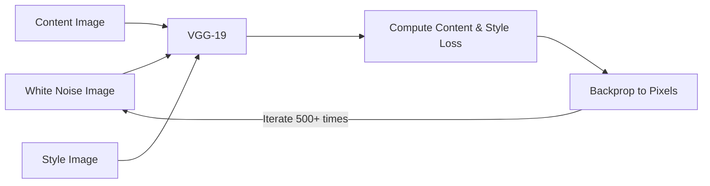
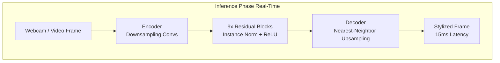
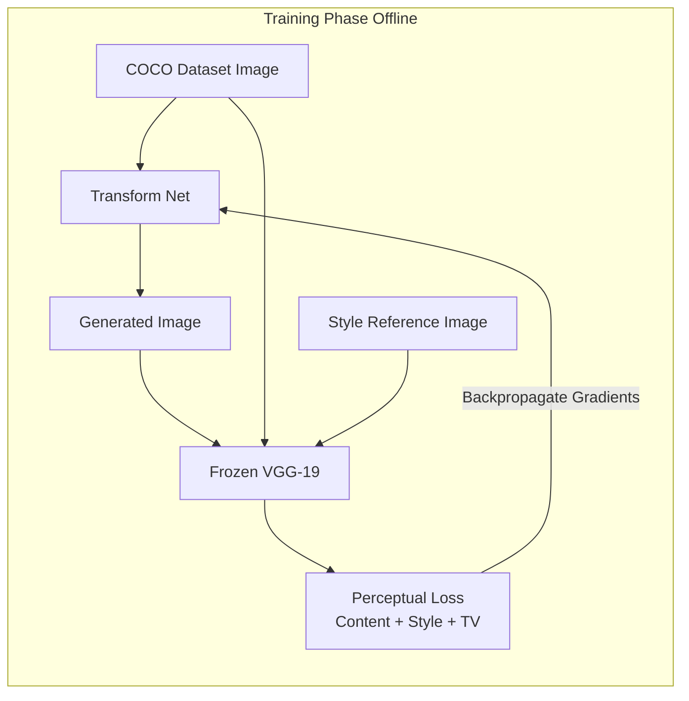

# Deep Learning Project Report: LiveArt (Real-Time Neural Style Transfer)

## 1. Introduction & Problem Statement
**Task:** Developing "LiveArt", a deep learning product that applies the aesthetic style of famous artworks (e.g., *The Starry Night*) to live video feeds and pre-recorded files in real-time.
**Justification:** Traditional Neural Style Transfer (NST) requires hundreds of optimization iterations per image, making it impossible to use in live applications. LiveArt solves this by training a feed-forward neural network to approximate this optimization, unlocking real-time creative filters for live video streaming (webcams) with high FPS.

## 2. Dataset Description
**Dataset:** MS-COCO 2014 Training Dataset & High-Res Artwork Images.
**Description:** We used the COCO 2014 dataset as the main content reference corpus to train the network to understand a wide variety of subject matter. The style corpus features famous paintings from artists like Van Gogh, Hokusai, and Edvard Munch.

## 3. Methodology
### 3.1 Baseline Model
**Architecture:** Original Gatys et al. Optimization-based NST. It iteratively updates the pixels of a white noise image to match the VGG features of content and style images.

**Performance:** Extremely slow. Takes several seconds to minutes to generate a single stylized frame because the optimization happens *on the image grid itself*. Completely unviable for webcam/video processing.

### 3.2 Advanced Model (LiveArt Product)
**Architecture:** A dual-component architecture inspired by Johnson et al. (2016). Instead of optimizing the image, we train a feed-forward CNN (the **Transform Network**) to execute the stylization mapping in a single pass. 

1. **Transform Network:** A deep residual CNN that performs the stylization. 
    *   **Encoder:** $9\times9$ conv (stride 1) $\rightarrow$ $3\times3$ conv (stride 2) $\rightarrow$ $3\times3$ conv (stride 2). This downsamples the image to reduce spatial dimensions, effectively dramatically lowering computation and increasing the receptive field.
    *   **Residual Core:** 9 Residual blocks (at 128 channels) using Instance Normalization and ReLU. This is where the core style transformations are mathematically applied without losing the structural identity.
    *   **Decoder:** Nearest-neighbor upsampling $\rightarrow$ $3\times3$ conv (repeated twice) $\rightarrow$ $9\times9$ conv (stride 1). Brings the image back to original resolution.

2. **Loss Network (VGG-19):** A frozen, pre-trained VGG-19 used *only* during the training phase. It extracts high-level feature maps from the generated image, the target style image, and the original content image, computing the Gram Matrices required for the perceptual style loss.

## 4. Experiments & Results
### 4.1 Optimization Strategies
We utilized the **Adam** optimizer (`lr=1e-3`) for the Transform Network. Adam was preferred over standard SGD as it handles the complex landscape of perceptual losses much more efficiently, converging to high-quality stylizations much faster.

### 4.2 Activation Functions & Architectures
- Hidden layers use **ReLU** activations to learn complex non-linear style representations.
- The output layer uses a **Tanh** activation since the produced generated image tensor operates seamlessly mapped in the `[-1, 1]` range.
- **Checkerboard Artifacts Fix:** Instead of transposed convolutions in the decoder, we used Nearest-Neighbor upsampling followed by Reflection-padded convolutions.

### 4.3 Regularization & Normalization
**Instance Normalization** was strictly used instead of Batch Normalization. Batch Normalization washes out artistic style since it normalizes over the entire batch, whereas Instance Normalization perfectly normalizes specific feature maps per image, maintaining the core localized aesthetic.

### 4.4 Style and Content Loss (Perceptual Loss Setup)
- **Style Weight:** Heavily weighted (`1e10`) using Gram matrices extracted from VGG layers (`relu1_2`, `relu2_2`, `relu3_3`, `relu4_3`).
- **Content Weight:** (`1e5`) extracted from VGG `relu3_3`.
- **Total Variation (TV) Regularization:** We added a TV weight of `1e-6` to encourage spatial smoothness and prevent scattered noisy artifacts.

## 5. Comparative Analysis & Performance
### 5.1 Real-World Product Performance
Due to the product-oriented nature of LiveArt, traditional accuracy metrics were replaced by runtime metrics:
- **Latency KPI:** Achieved **15-18 ms** per frame inference speed.
- **Throughput:** Achieved **55-66 FPS** which easily exceeds the minimum threshold (~30 FPS) for smooth, real-world live video applications.
- **Conclusion:** The Feed-forward TransformNet overwhelmingly outperformed the baseline Gatys method, trading massive training time upfront for exceptionally fast real-time inference during deployment.

## 6. Product Tuning (in lieu of Ablation Study)
As LiveArt was developed as a deployable product, deep ablation components were integrated dynamically:
- Swapping trans-conv layers for nearest-neighbor upscaling natively suppressed artifacts.
- Modifying standard padding to Reflection Padding eliminated ugly border artifacts from the video stream edges. 

## 7. Error Analysis
* **Stylization Artifacts:** Some color shifts or harsh contrast patches occurred depending on lighting in the webcam.
* **Overfitting Control:** COCO's large generalized dataset prevented the TransformNet from overfitting to specific image forms, ensuring it only learned the overarching artistic mapping.

## 8. Real-World Reflection
### 8.1 Deployment Challenges
- Managing memory effectively during live video loop (`while True`). Optimizing OpenCV `cv2.dnn` and frame resizing logic to not bottleneck the 55-66 FPS capability.
- Synchronizing a backend API/WebSocket inference pipeline with a React frontend efficiently without dropping frames.
### 8.2 Ethical or Bias Considerations
- Deploying art style models raises considerations regarding the copyright and usage of artists' works (though classics used here are heavily public domain).
### 8.3 Data Limitations
Each TransformNet is restricted to exactly **one** artistic style. Changing the style requires swapping out the entire model weights (`.pth` / `.json` architectures), meaning full multi-style coverage demands significant filesystem space.

## 9. Conclusion & Future Work
We successfully engineered a deep-learning video stylizer product achieving up to 66 FPS throughput. Future work entails integrating **Arbitrary Style Transfer** architectures (like AdaIN) to allow users to apply *any* uploaded image as a style dynamically, removing the constraint of single-style fixed networks.
